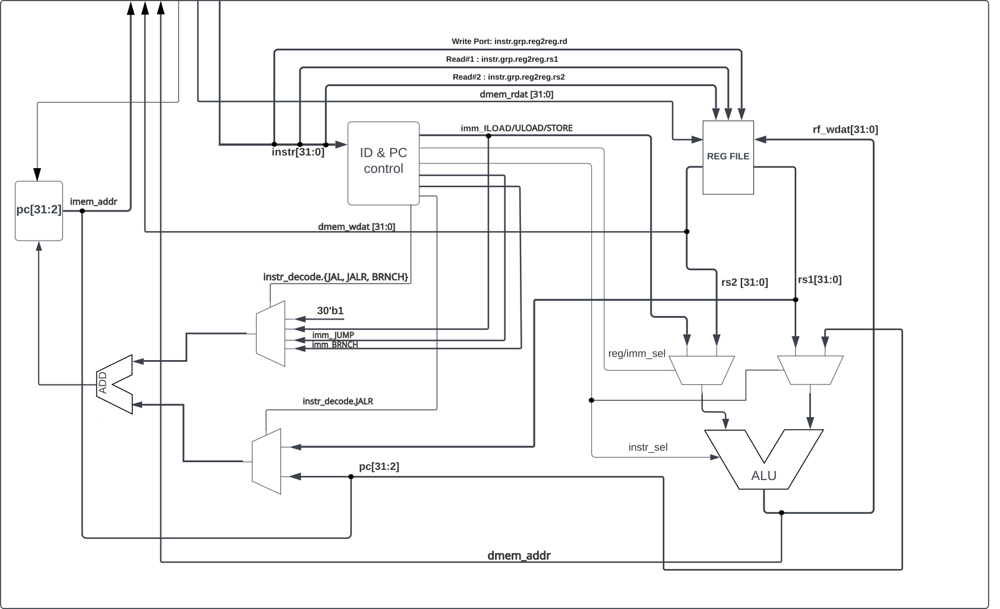

# eduBOS5
A compact, configurable RISC-V core
## Design characteristics 
The CPU is a single cycle full user-level RV32I RISC-V ISA implementation. What stands out is a relatively short 2-cycle execution pipeline, which can be configured to a 3-cycle alternative. Neat SystemVerilog-2017 code allows for easy customization and leads to effortless understanding of the RTL. This feature is the reason why education will be a major goal in this endeavor.

Space for improvement is an important consideration while building this core, enhancements and features are in sight since day one:
- Superscalar implementation
- Instruction & data prefetch 
- Branch prediction
- Interrupt handling
- FreeRTOS support
- CPU emulation support 

Until the CPU is finalized, here is a teaser block diagram representing the design concept.

## Verification strategy

While developing, small, hand-written tests in combination with observing waveforms, are used to verify every inidividual instruction and instruction type. After the core is finished, it will undergo standard testing using [riscv-tests](https://github.com/riscv-software-src/riscv-tests) as the main validation tool. 
Following that, formal verification using open source [SymbiYosys](https://github.com/YosysHQ/sby) will be conducted, trying to eliminate chances for error.

## Target performance and size
The intent is to have a small, yet capable core. Main development platform is the Gowin LittleBee FPGA family, handing in utilization and performance figures of:
- CPI 2/3
- < 1000 Gowin LUTs
- < 100  FFs

An initial working version will undergo a series of custom performance comparison tests, along with standard benchmarks such as Dhrystone, to assess its performance.