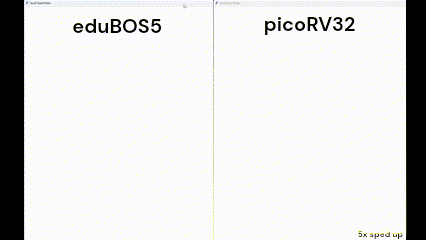

# eduBOS5
A soft configurable RISC-V micro-controller, custom-tailored for FPGAs, high on compute throughput, low on everything else. 

This project includes a complete, pre-configured toolchain and workflow for deploying custom hardware and software for eduBOS5 core. While Gowin FPGAs were the initial target, porting to Xilinx, LatticeSemi and CologneChip is also underway. For best results, we recommend using proprietary FPGA synthesis and place-and-route tools. This is not to say that Yosys won't work, but rather that _nextpnr_ and _P_R_ are still [lacking](https://github.com/chili-chips-ba/openCologne/issues/18#issuecomment-2249085341) on the timing-driven, and even timing-aware side of things. 

The entire verification flow, including QA and linting, is based on open-source tools. 

Given that eduBOS5 RTL is not in the open-source domain, the build steps are not included in this public repo. Reach out to [Chili.CHIPS*ba](https://www.chili-chips.xyz) for details about our consulting engagement models, esp. if you are looking to put together a system with eduBOS5, complete with SOC, custom accelerators and software app for it.

## Design overview
**eduBOS5** is single-threaded (1 hart = hardware thread) Machine Mode (M) privilege implementation of RV32I RISC-V ISA. The RTL is written in clean SystemVerilog-2017, making use of language features that enhance readability and simplify debugging. 

The unusually short `execution pipeline of only 2-cycles` is what sets eduBOS5 apart. A 3-cycle pipeline option is also provided. When used in combination with MCPs, this option yields higher Fmax. Gowin variants also include option for constructing ALU from DSP HMs. That brings another (at least 30MHz) Fmax boost compared to the stock, LUT-based ALU implementation. 

Simulation is another major differentor. We provide two options there:
- Cycle-accurate, all-RTL testbench
- Fast, ISS-based HW/SW co-sim, by tapping into [Vproc](https://github.com/wyvernSemi/vproc) technology.

Our other customization options are:
- Instruction & Data prefetch (i.e. Caches: I$, D$)
- Branch Prediction
- Interrupt Handling  
- extensive portfolio of Accelerators for DSP and AI workloads
- Zicsr + Machine Registers = FreeRTOS support
- Multi-Threading (MT)
- Superscalar execution
- Hardware handling of misaligned data access (as opposed to software traps).

Stock/basic eduBOS5 is primarily intended for deeply-embedded, bare-metal (aka non-hosted / freestanding) apps. However, FreeRTOS support and everything that comes with it is an add-on option. 

### Block diagram
eduBOS5 is designed around Harward-based architecture, with separate buses for Instruction and Data Memory. The diagram below illustrates the concept. Please note that this diagram does not show all detail, and esp. not the pipeline registers that are carefully placed to maximize operating frequency.

## Verification strategy

Both dynamic (Functional) and static (Formal) methods are put to use for **eduBOS5** validation, all based on open-source [Verilator](https://github.com/verilator/verilator) and [SymbiYosys](https://github.com/YosysHQ/sby) tool chains. Verilator testbench is written in SystemVerilog, with C++ backend.

Hand-crafted tests in Assembly are used to verify each individual instruction, both on actual hardware, and in functional simulation with waveform analysis. RISC-V standard compliance software suite with [riscv-tests](https://github.com/riscv-software-src/riscv-tests) is checked off. FV is based on [RISC-V Formal tests](https://github.com/YosysHQ/riscv-formal).

## Current/Target performance and size (WIP)

**eduBOS5** design goal is to be a physically small and compact, yet unusually capable core. It is to form a foundation for custom hardware accelerators, tapping into both RISC-V user-defined instructions facility and classic co-processing techniques.

We have benchmarked the following design variants:
- Register File (RF) implemented in both Distributed SSRAM (aka LUTRAM) and Block BSRAM
- ALU implemened in both generic LUTs and DSP HM
For complete perspective, the comparison data also includes desktop class Pentium and RPi Pico processors.

The baseline development platform are entry-level Gowin LittleBee and low/mid Arora FPGAs. 

Executive Summary performance and utilization metrics are as follows:
- **CPI = 2.56**
- **Area = cca 1000 Gowin LUTs + 400 FFs**
- **Fmax = 80-100MHz**
- **DMIPS/MHz = 0.39** (Dhrystone)
  
### Performance evaluation and comparison

[PicoRV2](https://github.com/YosysHQ/picorv32) in the stock configuration (w/o any add-on bells and whisles) is the primary target of this comparison. 

Here is a real-life use-case (computation of Mandelbrot fractals) for performance assessment beyond dry synthetic tests.

### Performance/Power/Area table across FPGAs

These metrics are acquired using a minimal SOC, featuring only an UART, memory, LEDs and user buttons. Although not shown in this table, thanks to its smart I/O pipelinining, `eduBOS5 is frequency-resilient to SOC expansion`. On the other hand, PicoRV32 Fmax keeps reducing as more peripherals are added to the system.

We used basic **PicoRV32** variant for this comparison, which is on par with basic eduBOS5. By throwing in a few optimizations (such as DSP_ALU), eduBOS5 may achieve the same Fmax as PicoRV32. 

In any case, thanks to its much shorter pipeline, `eduBOS5 consistently outperforms PicoRV32`, even in its simplest LUT-only ALU configuration. We can conclude that the basic eduBOS5 is on par with AVR ATmega328P.

#### End-of-Document
