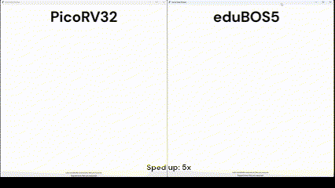

# eduBOS5
A soft configurable RISC-V micro-controller, custom-tailored for FPGAs, high on compute throughput, low on everything else. 

This project includes a complete, pre-configured toolchain and workflow for deploying custom hardware and software for eduBOS5 core. While Gowin FPGAs were the initial target, porting to Xilinx, LatticeSemi and CologneChip is also underway. For best results, we recommend using proprietary FPGA synthesis and place-and-route tools. This is not to say that Yosys won't work, but rather that _nextpnr_ and _P_R_ are still [lacking](https://github.com/chili-chips-ba/openCologne/issues/18#issuecomment-2249085341) on the timing-driven, and even timing-aware side of things. 

The entire verification flow, including QA and linting, is based on open-source tools. 

Given that eduBOS5 RTL is not in open-source domain, the build steps are not included in this public repo. Reach out to [Chili.CHIPS*ba](https://www.chili-chips.xyz) to learn more about our consulting engagement models, esp. related to having us put together complete apps with eduBOS5, including SOCs with custom accelerators for your tasks at hand.

## Design overview
**eduBOS5** is a single-threaded implementation of RV32I RISC-V ISA. The RTL is written in clean SystemVerilog-2017, making use of language features that enhance readability and simplify debugging. 

What sets eduBOS5 apart is an unusually short execution pipeline of only 2-cycles. The 3-cycle pipeline option is also provided for higher Fmax. When used in combination with MCPs, even higher operating frequencies are within reach. The Gowin variant also includes option for building ALU from DSP HMs. That brings about at least 30MHz Fmax boost compared to the stock, LUT-based ALU implementation. 

Simulation is another major differentor. We provide two options there:
- cycle-accurate, all RTL testbench
- fast, ISS-based HW/SW co-sim, by tapping into [Vproc](https://github.com/wyvernSemi/vproc) technology.

Our other customization options are:
- Instruction & Data prefetch (i.e. Caches)
- Branch Prediction
- Interrupt Handling
- portfolio of Accelerators for DSP and AI workloads
- multi-threading and superscalar exectution

Zicsr is not implemented at the moment. eduBOS5 currenty runs only deeply-embedded, bare-metal, self-standing programs. However, FreeRTOS support is in the plans. Misaligned data access is based on software traps.

### Block diagram
eduBOS5 architecture is of Harvard type, with separate busses and ports for Instruction and Data Memory. The following diagram is conceptual and does not include all pipeline registers, which are carefully placed for better Fmax.

## Verification strategy

Both dynamic (Functional) and static (Formal) methods are employed in **eduBOS5** verification process, utilizing open-source [Verilator](https://github.com/verilator/verilator) and [SymbiYosys](https://github.com/YosysHQ/sby). Verilator testbench is written in SystemVerilog, with C++ backend.

Hand-crafted tests in Assembly are used to verify each individual instruction, both on actual hardware and in functional simulation with waveform analysis. RISC-V standard compliance testing with [riscv-tests](https://github.com/riscv-software-src/riscv-tests) is conducted. Formal verification is in the plans using [RISC-V Formal tests](https://github.com/YosysHQ/riscv-formal).

## Current/Target performance and size (WIP)

**eduBOS5** design goal is to be a small, yet capable core. It's to form a foundation for custom accelerators in hardware, tapping into both RISC-V user-defined instructions facility and classic co-processing techniques.

We have benchmarked the following design variants:
- [Register File (RF) implemented in SSRAM distributed memory (LUTRAM) or BSRAM]
- [ALU implemened in generic LUTs or DSP HM]
- [Superscalar, or singe-cycle]

Baseline development platform is entry-level Gowin LittleBee and low/mid Arora FPGA family. 

Executive Summary performance and utilization metrics are as follows:
- **CPI 2.56**
- ~**1000 Gowin LUTs**
- ~**400 FFs**
- **80-100 MHz Fmax**
- **0.39 DMIPS/MHz** (Dhrystone)
  
### Performance evaluation and comparison

[PicoRV2](https://github.com/YosysHQ/picorv32) in the stock configuration (w/o any bells and whisles add ons) served as a reference design. 

Assessing performance beyond synthetic tests, on a real-life use-case for computing Mandelbrot fractals and comparing times with **PicoRV32** is presented below.

### Performance/Power/Area table across FPGAs

Numbers listed are acquired using a minimal SOC, featuring an UART, memory, LEDs and user buttons. Although not shown in this table, **eduBOS5** is frequency resilient to adding more peripherals. On the other hand, PicoRV32 hasn't shown the same properties. We used basic **PicoRV32** for this comparison, which is the same size category as eduBOS5. **eduBOS5** needs some optimizations (such as DSP_ALU) in that case is to achieve the same Fmax as **PicoRV32**. Nevertheless, thanks to its much shorter pipeline, eduBOS5 outperforms PicoRV32 even in the LUT-only version.

#### End-of-Document
